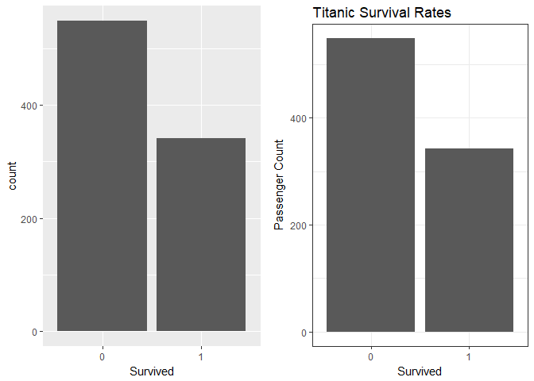
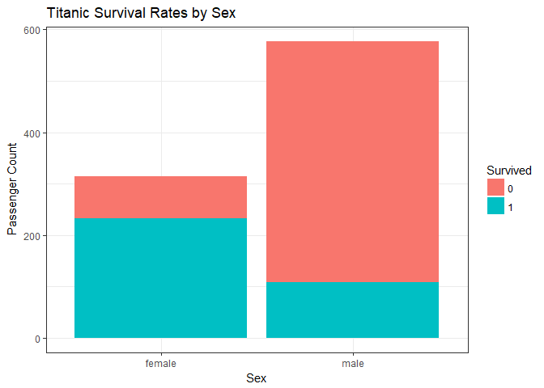
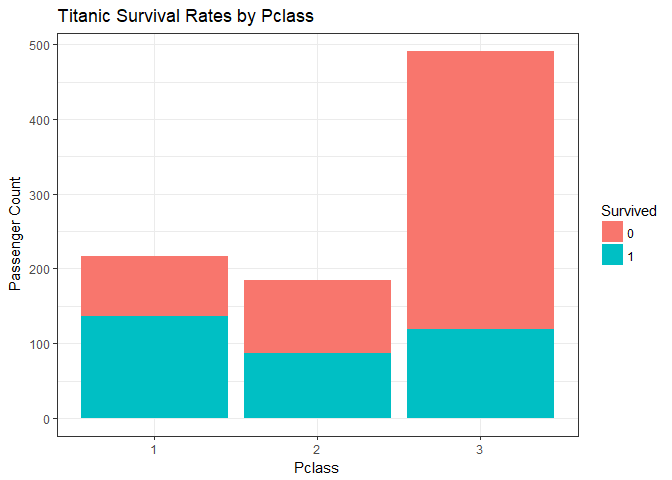
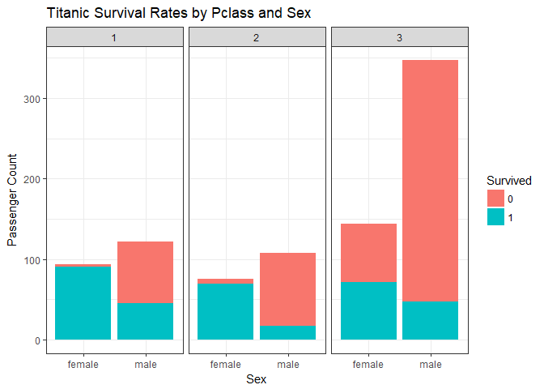
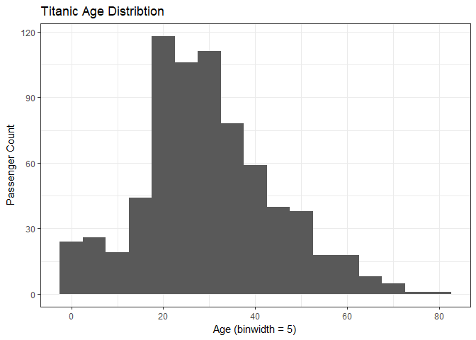
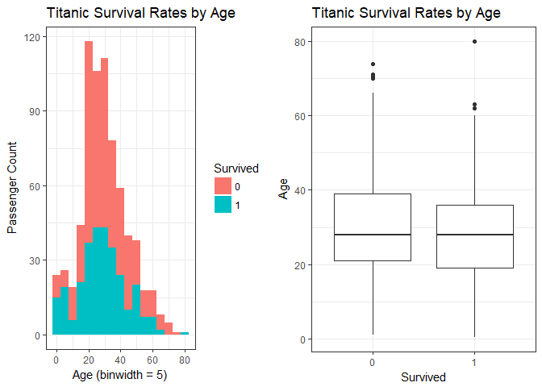
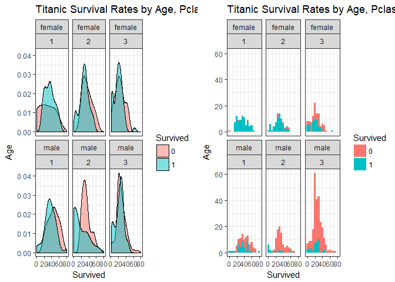

:::::

For problem number 3, I cloned the following repository

https://github.com/datasciencedojo/IntroDataVisualizationWithRAndGgplot2

which contains materials used in a webinar on data visualization with ggplot2 by Data Science Dojo. As mentioned in the repo, it uses the Titanic dataset from Kaggle, available from the link below.

https://www.kaggle.com/c/titanic

The dataset contains data on the passengers of the Titanic.

:::::

The script in the repo contains code that utilizes the ggplot2 package to create visualizations of a dataset in order to answer specific questions. Seven questions were posed about the Titanic dataset and plots and graphs were generated with the ggplot2 package to help answer these questions.

I did minor changes to some of the code in the script mainly for the purpose of having a more compact appearance. In the code chunks, only comments that are in square brackets [] are made by me and any code following my comments were added by me.

The tutorial started with the data preparation which consisted of importing the data (titanic.csv).

```r
#install.packages("ggplot2")
library(ggplot2)

# Load Titanic titanicing data for analysis. Open in spreadsheet view.
titanic <- read.csv("titanic.csv", stringsAsFactors = FALSE)
# View(titanic)

# [the original code ran the View(titanic) above but I changed it to
# head(titanic) below to display within the document that the data has
# been imported]
head(titanic)
```

```
##   PassengerId Survived Pclass
## 1           1        0      3
## 2           2        1      1
## 3           3        1      3
## 4           4        1      1
## 5           5        0      3
## 6           6        0      3
##                                                  Name    Sex Age SibSp
## 1                             Braund, Mr. Owen Harris   male  22     1
## 2 Cumings, Mrs. John Bradley (Florence Briggs Thayer) female  38     1
## 3                              Heikkinen, Miss. Laina female  26     0
## 4        Futrelle, Mrs. Jacques Heath (Lily May Peel) female  35     1
## 5                            Allen, Mr. William Henry   male  35     0
## 6                                    Moran, Mr. James   male  NA     0
##   Parch           Ticket    Fare Cabin Embarked
## 1     0        A/5 21171  7.2500              S
## 2     0         PC 17599 71.2833   C85        C
## 3     0 STON/O2. 3101282  7.9250              S
## 4     0           113803 53.1000  C123        S
## 5     0           373450  8.0500              S
## 6     0           330877  8.4583              Q
```

From the dataframe, variables that have categorical values were made into factors so that the categories in the variable become levels within the factors.

```r
# Set up factors.
titanic$Pclass <- as.factor(titanic$Pclass)
titanic$Survived <- as.factor(titanic$Survived)
titanic$Sex <- as.factor(titanic$Sex)
titanic$Embarked <- as.factor(titanic$Embarked)

# [to check what levels are in the variable above, I run the head()
# function for each factor]
head(titanic$Pclass)
```

```
## [1] 3 1 3 1 3 3
## Levels: 1 2 3
```

```r
head(titanic$Survived)
```

```
## [1] 0 1 1 1 0 0
## Levels: 0 1
```

```r
head(titanic$Sex)
```

```
## [1] male   female female female male   male  
## Levels: female male
```

```r
head(titanic$Embarked)
```

```
## [1] S C S S S Q
## Levels:  C Q S
```

The script then begins to create plots using ggplot() to answer questions. The 1st to 4th questions are based on the categorical values in the four variables: Class, Survived, Sex, and Embarked. The 5th to 7th questions are based on numerical values in present in other variables, such as Age.

1st question: What was the survival rate? -- For this question, a bar charte was generated fro the two survival categories: 0 (did not survive) and 1 (survived). Two charts were generated, one is the bare bones plot and the second has additional appearance elements to it.

```r
# [since some questions generate more than one plot or chart, I use the
# grid.arrange() function in the gridExtra package to combine them into one graphic]
library(gridExtra)
```


```r
# First question - What was the survival rate? 
#
# As Survived is a factor (i.e., categorical) variable, a bar chart 
# is a great visualization to use.
#
g1 <- ggplot(titanic, aes(x = Survived)) + 
  geom_bar() # [this is the bare bones chart. I put the charts in objects to combine]

# Add some customization for labels and theme.
g2 <- ggplot(titanic, aes(x = Survived)) + 
  theme_bw() +
  geom_bar() +
  labs(y = "Passenger Count",
       title = "Titanic Survival Rates") # [the second chart adds elements to it]

grid.arrange(g1, g2, nrow=1)
```

<!-- -->

```r
# If you really want percentages.
prop.table(table(titanic$Survived))
```

```
## 
##         0         1 
## 0.6161616 0.3838384
```

2nd question: What was the survival rate by gender? -- For this question, a bar chart was also generated where color was used to differentiate the survival rate within the gender.

```r
# Second question - What was the survival rate by gender? 
#
# We can use color to look at two aspects (i.e., dimensions)
# of the data simultaneously.
#
ggplot(titanic, aes(x = Sex, fill = Survived)) + 
  theme_bw() +
  geom_bar() +
  labs(y = "Passenger Count",
       title = "Titanic Survival Rates by Sex")
```

<!-- -->

3rd question: What was the survival rate by class of ticket? -- A bar chart similar to question 2 was generated but with class instead of gender.

```r
# Third question - What was the survival rate by class of ticket? 
#
ggplot(titanic, aes(x = Pclass, fill = Survived)) + 
  theme_bw() +
  geom_bar() +
  labs(y = "Passenger Count",
       title = "Titanic Survival Rates by Pclass")
```

<!-- -->

4th question: What was the survival rate by class of ticket and gender? -- This question combines the 1st, 2nd, and 3rd questions and generates a bar plot that incorporates all three variables to show the survival rates by gender and class. The graph is generated by plotting survival with gender first and then using the facet_wrap groups the plots by class.

```r
# Fourth question - What was the survival rate by class of ticket
#                   and gender?
#
# We can leverage facets to further segment the data and enable
# "visual drill-down" into the data.
#
ggplot(titanic, aes(x = Sex, fill = Survived)) + 
  theme_bw() +
  facet_wrap(~ Pclass) +
  geom_bar() +
  labs(y = "Passenger Count",
       title = "Titanic Survival Rates by Pclass and Sex") 
```

<!-- -->

5th question: What is the distribution of passenger ages? -- To plot the distribution of age, a histogram is created.

```r
# Fifth Question - What is the distribution of passenger ages?
#
# The histogram is a staple of visualizing numeric data as it very 
# powerfully communicates the distrubtion of a variable (i.e., column).
#
ggplot(titanic, aes(x = Age)) +
  theme_bw() +
  geom_histogram(binwidth = 5) +
  labs(y = "Passenger Count",
       x = "Age (binwidth = 5)",
       title = "Titanic Age Distribtion")
```

```
## Warning: Removed 177 rows containing non-finite values (stat_bin).
```

<!-- -->

6th question: What are the survival rates by age? -- Two plots were generated to help answer this question. The first plot is by using the same histogram as in question 5 but by adding the attribute 'fill' to ggplot() and setting it to the Survived variable, the histogram also shows the survival information within each age group. The second plot is by using a boxplot showing the age distribution based on the survival categories.

```r
# Sixth Question - What are the survival rates by age?
#
g3 <- ggplot(titanic, aes(x = Age, fill = Survived)) +
  theme_bw() +
  geom_histogram(binwidth = 5) +
  labs(y = "Passenger Count",
       x = "Age (binwidth = 5)",
       title = "Titanic Survival Rates by Age") # [the first plot is a histogram. I put the plots in objects to combine]

# Another great visualization for this question is the box-and-whisker 
# plot.
g4 <- ggplot(titanic, aes(x = Survived, y = Age)) +
  theme_bw() +
  geom_boxplot() +
  labs(y = "Age",
       x = "Survived",
       title = "Titanic Survival Rates by Age") # [the second plot is a boxplot]

grid.arrange(g3, g4, nrow=1)
```

```
## Warning: Removed 177 rows containing non-finite values (stat_bin).
```

```
## Warning: Removed 177 rows containing non-finite values (stat_boxplot).
```

<!-- -->

7th question: What is the survival rates by age when segmented by gender and class of ticket? -- Two plots were also generated to help answer this question. For both plots, the facet_wrap feature was used to group plots of age distribution by gender and class. The first plot is in the form of a density plot and the second plot a histogram.

```r
# Seventh Question - What is the survival rates by age when segmented
#                    by gender and class of ticket?
#
# A related visualization to the histogram is a density plot. Think of
# a density plot as a smoothed version of the histogram. Using ggplot2
# we can use facets to allow for visual drill-down via density plots.
#
g5 <- ggplot(titanic, aes(x = Age, fill = Survived)) +
  theme_bw() +
  facet_wrap(Sex ~ Pclass) +
  geom_density(alpha = 0.5) +
  labs(y = "Age",
       x = "Survived",
       title = "Titanic Survival Rates by Age, Pclass and Sex") # [the first plot is a density plot. I put the plots in objects to combine]

# If you prefer histograms, no problem!
g6 <- ggplot(titanic, aes(x = Age, fill = Survived)) +
  theme_bw() +
  facet_wrap(Sex ~ Pclass) +
  geom_histogram(binwidth = 5) +
  labs(y = "Age",
       x = "Survived",
       title = "Titanic Survival Rates by Age, Pclass and Sex") # [the second plot is a histogram]

grid.arrange(g5, g6, nrow = 1)
```

```
## Warning: Removed 177 rows containing non-finite values (stat_density).
```

```
## Warning: Removed 177 rows containing non-finite values (stat_bin).
```

<!-- -->

